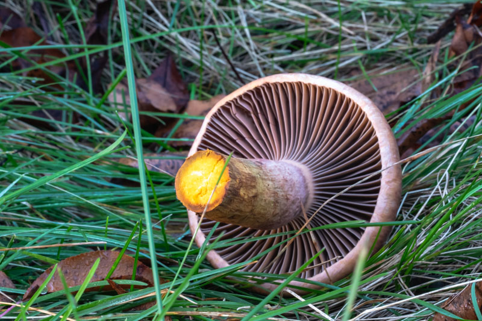

# Argill Milkcap (*Lactarius argillaceifolius*)

**Habitat:** Pine duff and grass near Lakeville, MN  
**Cap:** Smooth, clay-colored to tan  
**Gills:** Cream, close, exuding white latex that yellows on exposure  
**Stem:** Firm, hollowing with age  
**Spore print (expected):** Pale yellowish buff  

The clay-colored milkcap (*Lactarius argillaceifolius*) matched both size and color from the Audubon description.  
The latex slowly turns yellow — like the forest leaving its signature.

> *Tomorrow, I’ll try a spore print — a quiet experiment to catch the forest’s handwriting in yellow dust.*

**References:**  
- *National Audubon Society: Mushrooms of North America* (April 2023) 
Personal field notes (2025)
